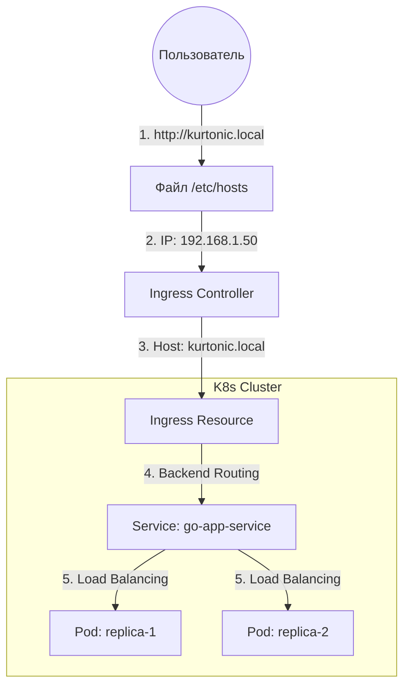

Go Calculator (K8s Cloud-Native Project)
Веб-приложение для вычислений, написанное на Go, развернутое в Kubernetes-кластере с использованием современного стека автоматизации.
# Стек технологий
Backend: Go 1.24 (Framework Gin Gonic)
Runtime: containerd + nerdctl (без использования Docker Docker Engine)
Orchestration: Kubernetes v1.35.1
Deployment: Helm 3
CI/CD: GitLab CI + Kaniko (rootless image build)
# Архитектура и трафик
Проект демонстрирует полный путь запроса от клиента до контейнера в изолированной сети.



# CI/CD Pipeline
Автоматизация реализована через .gitlab-ci.yaml и включает 4 стадии:
Build: Сборка Go-бинарника (артефакт app).
Test: Запуск модульных тестов (go test ./...).
Push: Сборка Docker-образа через Kaniko. Это позволяет собирать образы внутри K8s без привилегированного доступа и Docker-in-Docker.
Deploy: Деплой в кластер через Helm. Тег образа автоматически обновляется на основе короткого SHA коммита.
# Установка и запуск
Локально (Development)
```
go run main.go
```

Приложение будет доступно на http://localhost:8080.
В кластере (Production-ready)
Настройка containerd:
Убедитесь, что в /etc/containerd/config.toml прописан config_path для работы с вашим реестром по HTTP/HTTPS.
Деплой через Helm:
```
helm upgrade --install go-app ./charts/go-app \
  --set image.repository=$CI_REGISTRY_IMAGE \
  --set image.tag=latest
```

# Доступ:
Добавьте запись в /etc/hosts:
text
<указываем_ваш_ip_хоста> kurtonic.local


# Структура репозитория
main.go — Серверная логика и API (Gin).
templates/ — UI шаблоны (index, result, error).
charts/go-app/ — Helm-чарт (Deployment на 2 реплики, ClusterIP Service, Ingress).
Dockerfile — Легковесный образ на базе Alpine.
test/ — Модульные тесты приложения.
myapp.service — (Legacy) Конфиг для запуска через systemd.
# Мониторинг и отладка
Посмотреть логи всех реплик сразу:
```
kubectl logs -l app.kubernetes.io/name=go-app -f
```

Проверить статус здоровья:
```
curl http://kurtonic.local
```